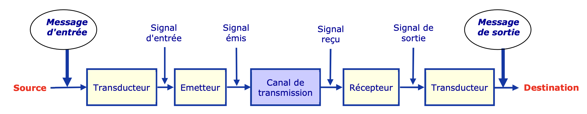
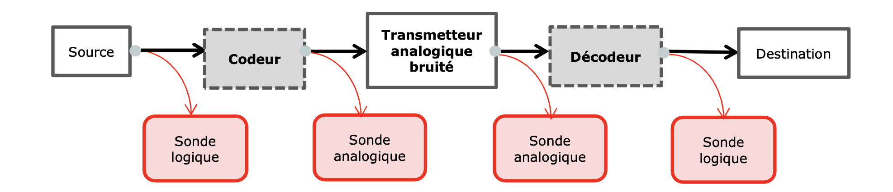
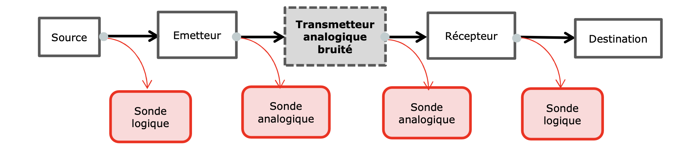
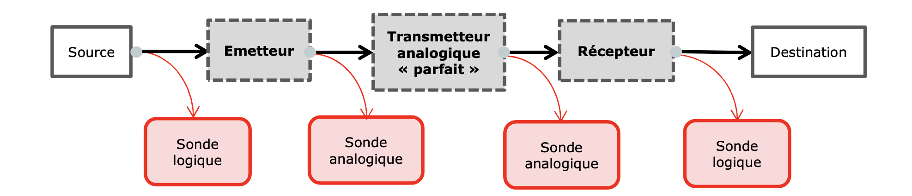
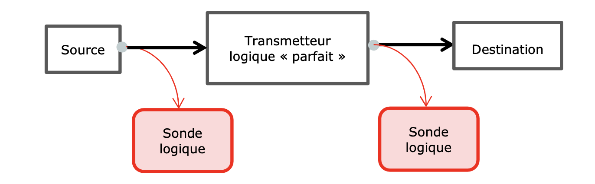

<!-- Improved compatibility of back to top link: See: https://github.com/othneildrew/Best-README-Template/pull/73 -->

> ### ⚠️ Disclaimer
>
> **Attention aux étudiants d'IMT Atlantique :** Ce projet est destiné à des fins pédagogiques. Toute reproduction non autorisée constitue une infraction aux règles académiques et peut entraîner des sanctions. Utilisez-le uniquement comme référence pour votre apprentissage.

<!-- PROJECT LOGO -->

  

  <h3 align="center">SIT213 - Simulateur de chaîne de transmission</h3>

  

    Simulation d'un système de chaîne de transmission analogique en Java
     
     
    <a href="https://sit213-m23maque-03224fc893efd631ee75b3492a771a16117a0b8b074f6be.gitlab-df-pages.imt-atlantique.fr">Accéder à la Javadoc</a>
    ·
    <a href="https://gitlab-df.imt-atlantique.fr/m23maque/sit213/-/raw/main/reports/step-5/step-5-report.pdf?ref_type=heads&inline=false">Télécharger le rapport "Étape 5"</a>
  

<!-- TABLE OF CONTENTS -->

  
Table des matières

  <ol>
    <li><a href="#-description-du-projet">Description du projet</a></li>
    <li><a href="#paramètres">Paramètres</a></li>
    <li><a href="#tp6-cas-détude">TP6: Cas d'étude</a></li>
    <li><a href="#tp5-transmission-analogique-avec-un-codage-de-canal">TP5: Transmission analogique avec un codage de canal</a></li>
    <li><a href="#tp4-transmission-analogique-avec-un-canal-bruité-à-trajets-multiples">TP4: Transmission analogique avec un canal bruité à trajets multiples</a></li>
    <li><a href="#tp3-transmission-analogique-avec-un-bruit-gaussien">TP3: Transmission analogique avec un bruit gaussien</a></li>
    <li><a href="#tp2-transmission-analogique-non-bruitée">TP2: Transmission analogique non bruitée</a></li>
    <li><a href="#tp1-transmission-élémentaire-back-to-back">TP1: Transmission élémentaire back-to-back</a></li>
  </ol>

## 📖 Description du projet

L’objectif consiste à transmettre un **message** d’un point d’entrée à un point de sortie, via un **canal de
transmission** (ou de communication). Le message d’entrée est émis par une **source** d’entrée. Les
messages considérés dans cet atelier seront des suites de **symboles binaires** (0 ou 1) correspondant
à des informations échantillonnées et quantifiées sur deux niveaux logiques. Le message de sortie
sera – autant que faire se peut - semblable au message d’entrée. Ce dernier étant incapable de
traverser le canal de propagation tel quel, on l’adaptera aux caractéristiques physiques du canal en le
convertissant au moyen d’un **transducteur** en un « vecteur » adapté à la transmission, appelé **signal**.
Ce dernier sera injecté dans le canal au moyen d’un **émetteur**. À l’autre extrémité du canal, il sera
récupéré et traité par le **récepteur** et le transducteur de réception.

Les principaux canaux de transmission rencontrés dans la nature sont : le canal Hertzien (espace
libre), le canal guidé électrique (câble), le canal guidé Optique (fibre), le canal acoustique aérien et le
canal acoustique sous-marin. Chaque canal de propagation devant être utilisé à une fréquence bien
particulière, le message est transposé autour de cette fréquence par l’opération de modulation. En
outre, le canal sera une source de bruit pour les signaux qu’il transporte. Les principales sources de
bruit rencontrées en pratique sont : la dispersion de trajets, la dispersion chromatique, le bruit de
détection (grenaille), le bruit thermique et le bruit d’amplification.
Par la suite, chaque composant du système de transmission entre la source et la destination sera
dénommé **transmetteur**.

<figure>
  
  <figcaption align="center">Schéma élémentaire d'une chaîne de transmission</figcaption>
</figure>

## Paramètres

Le simulateur accepte divers paramètres pour configurer la transmission :

- `-mess <m>` : Définit le message à transmettre ou sa longueur.
  - Si `m` comporte plus de 7 chiffres composés de 0 et de 1, `m` est le message à transmettre.
  - Si `m` comporte moins de 7 chiffres et correspond à la représentation en base 10 d'un entier, cet entier est la longueur du message que le simulateur doit générer aléatoirement et transmettre.
  - Par défaut : 100 bits aléatoires.
- `-s` : Active les sondes pour visualiser les signaux intermédiaires.
- `-seed <v>` : Définit une graine pour la génération aléatoire, permettant de rejouer une simulation.
- `-form <f>` : Choix de la forme d'onde pour le signal analogique (`NRZ`, `NRZT`, `RZ`). Par défaut : `RZ`.
- `-nbEch <ne>` : Nombre d'échantillons par bit pour le signal analogique. Par défaut : 30.
- `-ampl <min> <max>` : Définit l'amplitude minimale et maximale du signal analogique. Par défaut : `0.0` à `1.0`.
- `-snrpb <s>` : Rapport signal/bruit (Eb/N0) en dB pour ajouter du bruit gaussien.
- `-ti <dt> <ar>` : Simule des trajets multiples (décalage `dt`, amplitude relative `ar`). Maximum de 5 couples.
- `-codeur` : Active le codage de canal pour améliorer la transmission.

---

## TP6: Cas d'étude

#### Objectifs

- Utiliser le simulateur sur un cas d'étude précis (voir sujet).

### Modifications des scripts

- `plot_teb_comparaison.py` : Trace la courbe du TEB théorique et du TEB pratique pour la modulation NRZ.
- Suppression des scripts `plot_teb_vs_snr.py` et `plot_proba_erreur_vs_ebn0.py`.

### Modifications des classes

- Ajout des classes `ExportCSVEnvironnement1` et `ExportCSVEnvironnement2` pour générer des valeurs en fonction de différents paramètres et trouver les combinaisons qui répondent aux attentes du cas d'étude.

## TP5: Transmission analogique avec un codage de canal

### Schéma

<figure>
  
  <figcaption align="center">Modélisation de la chaîne de transmission à l'étape 5</figcaption>
</figure>

### Objectifs

- Ajouter la possibilité d'utiliser un codage de canal pour permettre de :
  - Repérer et réparer des erreurs eventuelles lors de la transmission.
  - Réduire le taux d'erreur binaire de la chaîne de transmission.
- Mesurer les améliorations.

### Ajout de nouveaux flags au CLI

- `-codeur`: Utilisation d'un codage de canal. Valeur par défaut : non utilisé.

### Modifications des scripts

- Modification du script `runTests` pour y ajouter une fonction permettant de shuffle les flags du CLI.

### Modifications des classes

- Ajout des classes `Codeur` et `Decodeur` pour utiliser un canal de codage.
- Ajout de la classe `CodeurDecodeurTest` pour tester le comportement des classes `Codeur` et `Décodeur`.
- Modification de la classe `Simulateur` pour prendre en compte le flag `-codeur`.

## TP4: Transmission analogique avec un canal bruité à trajets multiples

### Objectifs

- Ajouter la possibilité d'utiliser une transmission multi-trajets.

### Ajout de nouveaux flags au CLI

- `-ti <[int] [float]> <[int] [float]> ...`: Utilisation d'une transmission analogique multi-trajets. 5 couples de valeurs au maximum.
  - `dt` (int) précise le décalage temporel (en nombre d'échantillons)
  - `ar` (float) précise l'amplitude relative du signal du trajet indirect par rapport à celle du trajet direct.

### Ajout de scripts

- `plot_teb_multi_trajets.py`: Trace les courbes de la probabilité d'erreur binaire en fonction :
  - Du nombre de trajets indirects ajoutés.
  - De l'amplitude des trajets indirects.
  - Du décalage temporel des trajets indirects.

### Modifications des classes

- Ajout de la classe `TransmetteurMultiTrajets` pour utiliser un canal de transmission à trajets multiples.
- Ajout de la classe `TransmetteurMultiTrajetsTest` pour tester le comportement de la classe `TransmetteurMultiTrajets`.

## TP3: Transmission analogique avec un bruit gaussien

### Schéma

<figure>
  
  <figcaption align="center">Modélisation de la chaîne de transmission à l'étape 3</figcaption>
</figure>

### Objectifs

- Générer un bruit gaussien et l'ajouter lors de la transmission.
- Vérifier que le bruit suit bien une loi gaussienne en traçant un histogramme.

### Ajout de nouveaux flags au CLI

- `-snrpb [float]`: Choix du RSB par bit en dB. Valeur par défaut : 0.

### Ajout du répertoire `scripts`
Ce répertoire contient des scripts utiles au projet et aux tests visuels :

- `histogram_noise.py` : Trace l'histogramme des valeurs de bruit gaussien.
- `plot_teb_vs_snr.py` : Trace la courbe du TEB en fonction du SNR pour les différentes modulations.
- `plot_proba_erreur_vs_ebn0.py`: Trace la courbe de la probabilité d'erreur binaire en fonction du rapport Eb/N0 pour les différentes modulations.

### Modifications des classes

- Ajout de la classe `TransmetteurGaussien` pour générer un signal analogique avec un bruit gaussien.
- Ajout de la classe `TransmetteurGaussienTest` pour tester le comportement de la classe `TransmetteurGaussien`
- Modifications des classes `Simulateur`, `Emetteur` et `Recepteur` pour intégrer le transmetteur gaussien.

## TP2: Transmission analogique non bruitée

### Schéma

<figure>
  
  <figcaption align="center">Modélisation de la chaîne de transmission à l'étape 2</figcaption>
</figure>

### Objectifs

- Ajouter les modules d'émission et de réception (resp. Émetteur et Récepteur) pour prendre en compte la nature analogique du canal.

### Ajout de nouveaux flags au CLI

- `-form [string]`: Choix du form à utiliser. Valeur par défaut : RZ. Les options disponibles sont :
  - `NRZ`
- `NRZT`
- `RZ`
- `-ampl [float] [float]`: Choix de l'amplitude, la première valeur est l'amplitude minimale et la seconde est l'amplitude maximale. Valeurs par défaut : 0 et 1.
- `-nbEch [int]`: Choix du nombre d'échantillons par bit. Valeur par défaut : 30.

### Ajout du répertoire `librairies`

Ce répertoire contient un ensemble de fichiers .jar qui permettent d'importer des fonctionnalités déjà codées.  
Il contient les fichiers suivant :
- `easymock-5.4.0.jar`: Permet de simuler le résultat de fonctions.
- `junit-4.13.1.jar`: Permet de réaliser des tests unitaires pour tester le bon fonctionnement des méthodes.
- `hamcrest-core-1.3.jar`: Dépendance pour JUnit.

## TP1: Transmission élémentaire back-to-back

### Schéma

<figure>
  
  <figcaption align="center">Modélisation de la chaîne de transmission à l'étape 1</figcaption>
</figure>

### Objectifs

- Mettre en place une chaîne de transmission simple avec un transmetteur logique "parfait".

### Contenu de l'archive à livrer

- `bin/`: Répertoire contenant le form compilé.
- `docs/`: Documentation générée automatiquement sous forme de Javadoc.
- `src/`: Répertoire contenant le form source du projet.
- `cleanAll`: Script Bash qui nettoie le projet en supprimant l'archive générée, les fichiers compilés et la documentation.
- `compile`: Script Bash utilisé pour compiler le projet.
- `genDoc`: Script Bash pour générer la documentation Javadoc à partir du form source.
- `runTests`: Script Bash qui exécute les tests pour vérifier le bon fonctionnement du projet.
- `README.md`: Fichier de documentation (ce fichier) qui détaille les composants et scripts du projet.